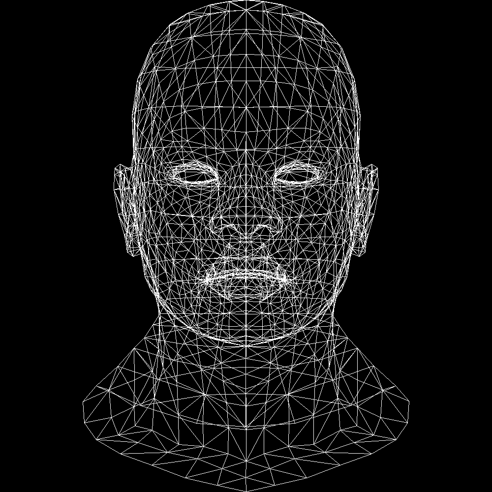
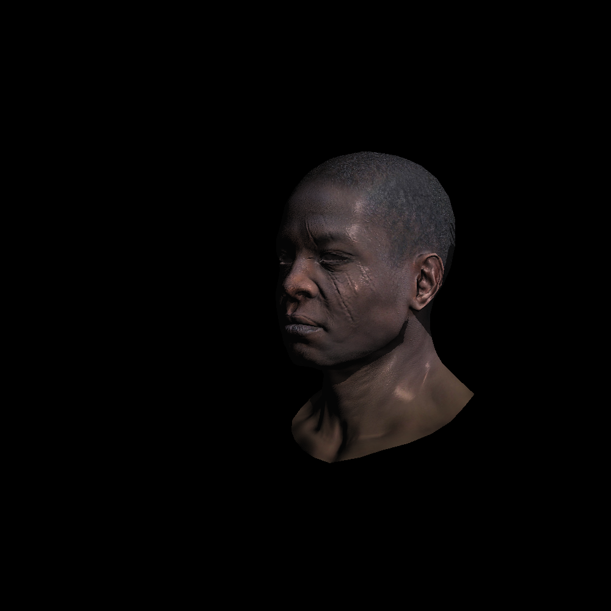

# TinyRenderer

## 简介

基于https://github.com/ssloy/tinyrenderer项目构建

一个lua和C混合使用的软件渲染demo

## 主要目的：

1. 注册函数到lua，尝试用lua调用c函数
   1. 熟悉c和lua之间栈操作
   2. 熟悉注册module
   3. 熟练使用userdata和table
   4. 尝试修改metatable（非继承）
2. 熟悉类似OpenGL的工作流程
3. 实现一个软渲染器：从绘制三角形开始 => 到画出有阴影的渲染图像
   1. 坐标系转换（MVP+viewport）
   2. zbuffer剔除
   3. 2 pass shading（shadow map）
   4. 应用texture, normal(or normal tangent)等纹理素材

## 代码运行

cpp入口程序是TinyRenderer（是一个cmake的target）

修改[environment.lua](lua/environment.lua)中的enable变量，来决定运行内容，[main.lua](lua/main.lua)中是实际的函数调用

**Reload CMake**时，lua修改会同步到build文件夹中（cmake file(COPY)触发）

## 效果图
### lesson 1 wireframe rendering

### lesson 7 shadow mapping
